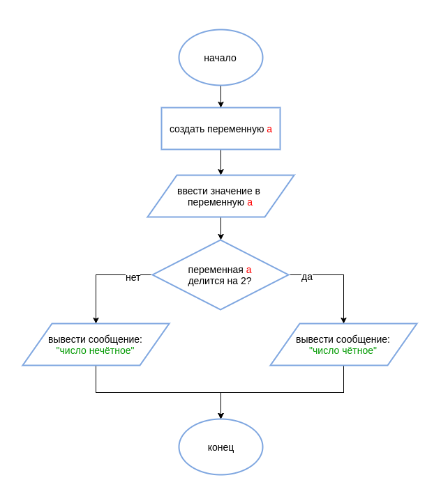

# Уроки по C++
Уроки для моего младшего брата

## Содержание
1. [Шаблон для программы](#Шаблон-для-программы)
2. [Переменные](#Переменные)
3. [Ввод и вывод данных](#Ввод-и-вывод-данных)
4. [Условия](#Условия)
5. [Циклы](#Циклы)
6. [Указатели (pointer)](#Указатели)
7. [Массивы](#Массивы)

## Шаблон для программы
```c++
// эти 2 строчки позволят удобно считывать и выводить данные на экран:
#include <iostream>
using namespace std;

int main() { // все программы на C++ начинаются с этой функции
  // здесь должен быть твой код
  return 0;
}
```
шаблон можно скачать здесь [base-template.cpp](templates/base-template.cpp)

## Переменные
Переменная — это простой способ хранения данных в памяти компьютера.

Благодаря тому, что у переменных есть своё имя (например переменная `count`), тебе не нужно запоминать адреса ячеек памяти, в которых хранятся твои данные.

Ты знаешь, что данные в компьютере хранятся в двоичном коде 10010110111... компьютер не может сам догадаться, какие именно данные лежат у него в памяти (картинка, музыка, программа, целое число, дробное число и т.д.), поэтому при создании переменной нам нужно сказать программе, какие данные мы будем там хранить.

```c++
int a; // переменная целого типа (например 1, 2, 1203, -435)
float b; // дробное число (например 1.32, -234.87)
char c; // символ (например 'a', 'b' или 'c')
```
После того, как мы создали нашу переменную, мы можем в нее что-нибудь записать

```c++
a = 2; // запишем 2 в переменную a
a = a + 3; // увеличим a на 3 (теперь a равно 5)
b = 3 / 2; // запишем в b результат вычисления 3 / 2 (теперь b равно 1.5)
c = 't'; // запишем в c символ 't'
```
## Ввод и вывод данных
Записать в переменную значение, которое мы будем вводить с клавиатуры, можно так:
```c++
cin >> a; // запишем значение в переменную
```
Вывести на экран переменную можно так:
```c++
cout << a + 2; // выведем переменную a, увеличенную на 2 
// (заметь, что при этом сама переменная не увеличится)
```
## Условия
Часто нужно сделать так, чтобы программа выполняла разные действия в зависимости от какого-нибудь условия.

Например на схеме ниже нарисован алгоритм, по которому пользователь сначала вводит число, потом программа проверяет, делится ли число на 2, и в зависимости от результата выводит сообщение: "число чётное" или "число нечётное".



На C++ условие записывается так:
```c++
if (условие) {
  // код, который нужно выполнить, если условие ВЕРНОЕ
}
else {
  // код, который нужно выполнить, если условие НЕВЕРНОЕ
}
```
Вместо слова `условие` может быть записано любое логическое выражение (это такое выражение, которое может быть либо правдой, либо ложью)

Например:
```c++
1 > 2 // это выражение ложно, потому что 1 на самом деле меньше чем 2
1 < 2 // это выражение правдиво
1 <= 1 // это выражение тоже правдиво, потому что 1 равно 1
1 == 1 // это выражение правдиво. Обрати внимание, что знак '=' значит "присвоить", а '==' значит "равняется"
```
Теперь напишем код, который говорит пользователю, ввел от чётное число или нечётное:
```c++
int a; // создаем переменную
cin >> a; // пользователь введет число с клавиатуры
if (a % 2 == 0) { // если остаток от деления на 2 равняется нулю (знак '%' это остаток от деления)
  cout << "число чётное";
}
else {
  cout << "число нечётное";
}
```
Часть `else` не обязательна, её можно убрать
```c++
int a;
cin >> a;
if (a < 0) {
  cout << "вы ввели отрицательное число";
}
```
Условий может быть несколько. Изучи следующий пример, и попытайся понять, что он делает:
```c++
char c; // создаем переменную для символа
cin >> c; // пользователь вводит символ
if (c == 'a') {
  cout << "вы ввели символ 'a'";
}
else if (c == 'b') {
  cout << "вы ввели символ 'b'";
}
else {
  cout << "вы ввели символ, который не равняется a или b";
}
```
В C++ нет типа данных, в котором бы хранились значения "правда" и "ложь", поэтому "правдой" считается любое значение, не равное 0, а ложью считается 0.

Вот пример:
```c++
cout << 2 == 2; // выведет 1, потому что 2 равно 2 - правда
cout << 2 == 1; // выведет 0, потому что 2 равно 1 - ложь

if (1) { // это условие будет выполняться всегда

}

if (0) { // это условие никогда не выполнится

}
```

## Циклы
### Цикл while
Слово "while" переводится как "пока". Это значит: *пока условие верное*, выполняй действия.
Этот цикл похож на условие `if`, отличие в том, что тело условия выполняется только 1 раз, а тело цикла выполняется снова и снова, пока условине не станет ложно.
```c++
while (условие) {
  // тело цикла
}
```
Вот это примеры бесконечных циклов:
```
while (1 == 1) { // бесконечный цикл, так как 1 всегда равно 1
  // тело цикла
}

while (1) { // бесконечный цикл, так как 1 это правда
  // тело цикла
}
```
А вот этот цикл никогда не выполнится:
```c++
while (0) { // 0 это всегда ложь

}
```
Напишем цикл, который выводит числа от 0 до 10 не включитльно
```c++
int i = 0;
while (i < 10) {
  cout << i; // выводим число
  i = i + 1; // увеличиваем его на 1
}
```

### Цикл for
Цикл `for` непростой. У него есть 3 части `for(начальное значение; условие продолжения; изменение)`
Несташно, если ты пока плохо понимаешь, что каждая часть делает.

Напишем код, который выведет на экран числа 0 1 2 3 4
```c++
int i; // переменная счётчик
for(i = 0; i < 5; i = i + 1) {
  cout << i << " ";
}
// программа выведет: 0 1 2 3 4
```
В примере выше:
1. мы создали переменную счетчик
2. в первой части цикла дали ей изначальное значение 0
3. во второй части поставили условие: цикл будет продолжаться, если i меньше 5
4. поставили изменение: на каждом шаге i будет увеличиваться на 1

## Указатели
Иногда нам нужно знать, где в памяти находится переменная. Для этого используется указатели (pointer).

**Указатель** - это особая переменная, которая хранит адрес и тип переменной.

Чтобы создать указатель, нужно поставить символ `*` после типа переменной:

```c++
int *pointerToInt; // указатель на переменную типа int
char *pointerToChar; // указатель на переменную типа char
float *pointerToFloat; // указатель на переменную типа float
```

После того как мы создали указатель, он еще НЕ указывает на переменную. Для того, чтобы он начал на что-либо указывать, нужно создать переменную и записать ее адрес в указатель.

Для того чтобы это сделать, есть 2 способа:

```c++
// первый способ:
int a; // создаем переменную a
int *pointerToInt; // создаем указатель
pointerToInt = &a; // записываем адрес переменной а в указатель
// что-то делаем с указателем
// ...

// второй способ
int *pointerToInt; // создаем указатель
pointerToInt = new int; // записываем в него адрес новой переменной типа int
// что-то делаем с указателем
// ...
delete pointerToInt; // удаляем переменную из памяти
// (каждый new должен иметь свой delete)
```

Чтобы работать с переменной, на которую ссылается указатель, нужно указатель **разыменовать**.

```c++
cout << *pointerToInt; // выведет значение, на которое указывает указатель
```

А вот так можно получить адрес переменной:
```c++
cout << &a; // выведет адрес переменной a
```

## Массивы
Если нам нужно хранить множество элементов одного типа (например, твои оценки по математике за прошедшую четверть), то лучше использовать массив, а не создавать много-много переменных.

Массив создается так:

```c++
int arr[5]; // создать массив arr, в котором будет лежать 5 переменных
```

### Запись значений в массив
У нас есть 2 способа записать значения в массив.
Первый способ — указать значения массива при его создании:

```c++
int arr[5] = {1, 2, 3, 4, 5} // создать массив с элементами 1, 2, 3, 4, 5
```

Второй способ — записать значения в отдельный элемент массива, используя индекс

```c++
arr[0] = 1; // запишем 1 в элемент массива с индексом 0
```

Сама переменная `arr` является **указателем (pointer)** на нулевой элемент массива. Это значит, что в ней содержится адрес и тип нулевого элемента.

```c++
cout << arr; // выведет адрес нулевого элемента массива. Например 0x7ffcd05772f0
cout << arr + 1; // выведет адрес первого элемента массива. 0x7ffcd05772f4
// программа понимает, что arr - это ссылка на переменную типа int,
// которая занимает в памяти 4 байта.
// Поэтому адреса нулевого и второго элемента отличаются на 4.
```

Если у нас есть указатель, то мы можем получить значение из него с помощью **операции разыменования**, которая записывается как `*pointer`

```c++
arr[0] = 5; // запишем 5 в нулевой элемент массива
arr[1] = 6;

cout << *arr; // вывделет 5, это значение, которое лежит по адресу 5
cout << *(arr + 1); // вывделет 6, это значение, которое лежит по адресу 5
```

`*arr == arr[0]`

`*(arr + 4) == arr[4]`
